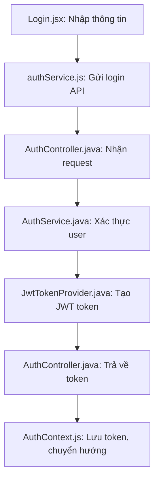
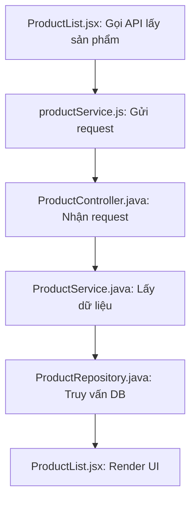
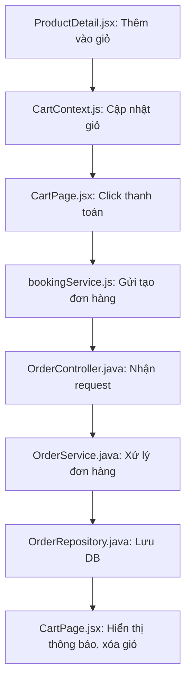
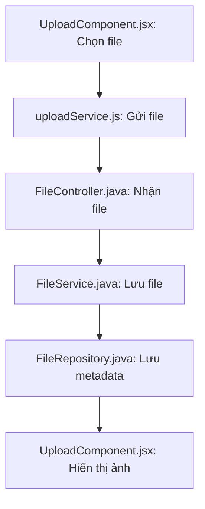
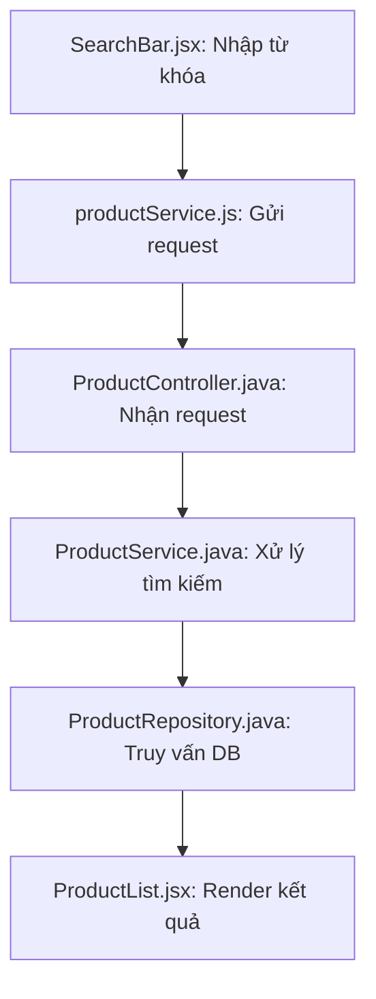
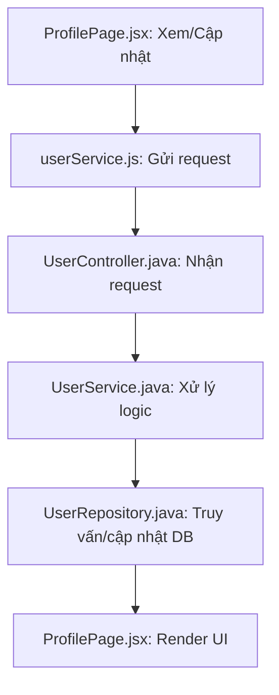
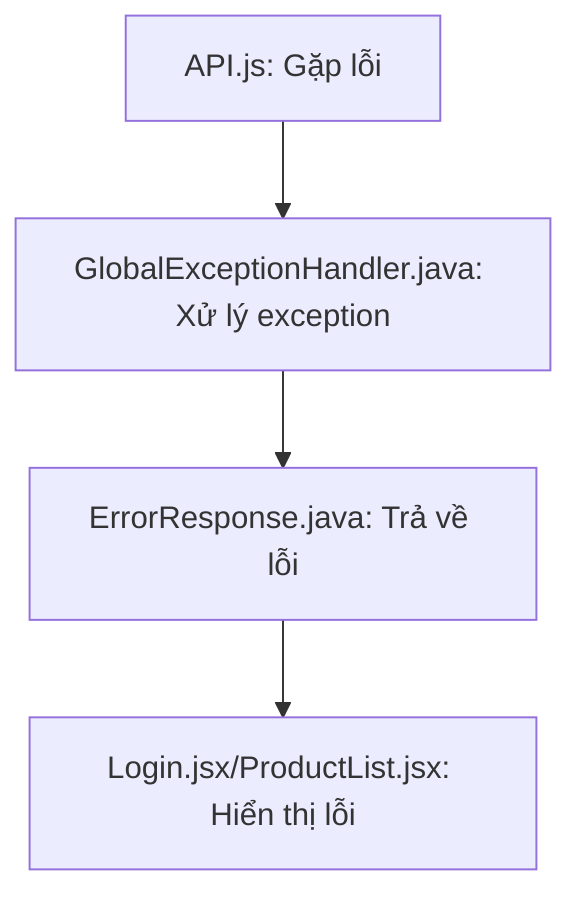

# Dự Án Website Bán Xe

## Giới Thiệu
Đây là một dự án website bán xe được xây dựng với kiến trúc hiện đại, sử dụng công nghệ Spring Boot cho backend và React cho frontend. Dự án được thiết kế để cung cấp trải nghiệm mua sắm xe trực tuyến thân thiện với người dùng.

## Cấu Trúc Dự Án

### 1. Backend (Phần Máy Chủ)

#### Cấu Trúc Thư Mục
```
backend/
├── src/main/java/com/bkap/
│   ├── admin/           # Quản lý phần admin
│   ├── config/          # Cấu hình hệ thống
│   ├── controller/      # Xử lý các request từ client
│   ├── entities/        # Các entity (bảng trong database)
│   ├── models/          # Các model dữ liệu
│   ├── repositories/    # Tương tác với database
│   ├── request/         # Các class xử lý request
│   ├── response/        # Các class xử lý response
│   ├── security/        # Cấu hình bảo mật
│   └── services/        # Xử lý business logic
```

#### Chi Tiết Các Thư Mục

1. **admin/**
   - Chứa các controller và service dành cho quản trị viên
   - Xử lý các chức năng quản lý sản phẩm, đơn hàng, người dùng

2. **config/**
   - `SecurityConfig.java`: Cấu hình bảo mật, phân quyền
   - `WebConfig.java`: Cấu hình CORS, các endpoint
   - `JwtConfig.java`: Cấu hình JWT token

3. **controller/**
   - Xử lý các HTTP request từ client
   - Mỗi controller tương ứng với một resource (UserController, ProductController, etc.)
   - Sử dụng annotation @RestController để xác định REST API endpoints

4. **entities/**
   - Định nghĩa các entity tương ứng với bảng trong database
   - Sử dụng JPA annotations (@Entity, @Table, etc.)
   - Ví dụ: User.java, Product.java, Order.java

5. **models/**
   - Chứa các DTO (Data Transfer Object)
   - Định nghĩa cấu trúc dữ liệu trao đổi giữa client và server

6. **repositories/**
   - Interface kế thừa từ JpaRepository
   - Cung cấp các phương thức CRUD cơ bản
   - Có thể định nghĩa thêm các query tùy chỉnh

7. **request/**
   - Chứa các class xử lý request từ client
   - Validation dữ liệu đầu vào
   - Ví dụ: LoginRequest.java, RegisterRequest.java

8. **response/**
   - Định nghĩa cấu trúc response trả về cho client
   - Bao gồm status code, message, data

9. **security/**
   - JwtTokenProvider.java: Xử lý tạo và validate JWT token
   - UserDetailsServiceImpl.java: Load user từ database
   - SecurityUtils.java: Các tiện ích bảo mật

10. **services/**
    - Chứa business logic
    - Implement các interface service
    - Xử lý dữ liệu trước khi lưu vào database

### 2. Frontend (Phần Giao Diện)

#### Cấu Trúc Thư Mục
```
frontend/src/
├── components/     # Các component tái sử dụng
├── context/       # React Context để quản lý state
├── hooks/         # Custom React hooks
├── pages/         # Các trang chính của ứng dụng
├── services/      # Xử lý API calls
└── utils/         # Các hàm tiện ích
```

#### Chi Tiết Các Thư Mục

1. **components/**
   - Chứa các component có thể tái sử dụng
   - Được tổ chức theo chức năng
   - Ví dụ: Button, Card, Modal, etc.

2. **context/**
   - Quản lý state global của ứng dụng
   - AuthContext: Quản lý trạng thái đăng nhập
   - CartContext: Quản lý giỏ hàng

3. **hooks/**
   - Custom hooks để tái sử dụng logic
   - useAuth: Xử lý authentication
   - useCart: Xử lý giỏ hàng
   - useApi: Xử lý gọi API

4. **pages/**
   - Chứa các component chính của từng trang
   - Được tổ chức theo route
   - Ví dụ: Home, ProductDetail, Cart, etc.

5. **services/**
   - Xử lý các API calls đến backend
   - Sử dụng axios để gọi API
   - Được tổ chức theo resource

## Luồng Xử Lý Chi Tiết

### 1. Luồng Đăng Nhập
```
[Frontend]                    [Backend]
     |                            |
     |-- 1. Người dùng nhập      |
     |   email và mật khẩu       |
     |   vào form đăng nhập      |
     |                          |
     |-- 2. Frontend kiểm tra    |
     |   tính hợp lệ của dữ liệu |
     |   (email phải đúng định   |
     |   dạng, mật khẩu phải    |
     |   có độ dài tối thiểu)    |
     |                          |
     |-- 3. Gửi request POST    |
     |   đến /api/auth/login    |
     |   với dữ liệu đăng nhập  |
     |                          |
     |                          |-- 4. AuthController nhận
     |                          |   request và chuyển đến
     |                          |   AuthService
     |                          |
     |                          |-- 5. AuthService kiểm tra:
     |                          |   - Tìm user trong database
     |                          |   - So sánh mật khẩu đã mã hóa
     |                          |   - Tạo JWT token nếu hợp lệ
     |                          |
     |                          |-- 6. Nếu đăng nhập thành công:
     |                          |   - Tạo JWT token chứa thông tin
     |                          |     user (id, role, etc.)
     |                          |   - Token có thời hạn 24 giờ
     |                          |
     |<-- 7. Trả về response    |
     |   chứa:                   |
     |   - JWT token            |
     |   - Thông tin user       |
     |   - Thông báo thành công |
     |                          |
     |-- 8. Frontend lưu token  |
     |   vào localStorage để    |
     |   sử dụng cho các request|
     |   tiếp theo              |
     |                          |
     |-- 9. Chuyển hướng người  |
     |   dùng đến trang chủ     |
     |   và hiển thị thông báo  |
     |   đăng nhập thành công   |
```

### 2. Luồng Xem Sản Phẩm
```
[Frontend]                    [Backend]
     |                            |
     |-- 1. Khi trang sản phẩm   |
     |   được tải, component     |
     |   ProductList được khởi   |
     |   tạo                     |
     |                          |
     |-- 2. Component gọi hook   |
     |   useProducts() để lấy    |
     |   danh sách sản phẩm      |
     |                          |
     |-- 3. Hook gửi request GET |
     |   đến /api/products với   |
     |   các tham số:           |
     |   - page: số trang       |
     |   - size: số sản phẩm/trang|
     |   - sort: sắp xếp        |
     |                          |
     |                          |-- 4. ProductController nhận
     |                          |   request và chuyển đến
     |                          |   ProductService
     |                          |
     |                          |-- 5. ProductService thực hiện:
     |                          |   - Tạo đối tượng Pageable
     |                          |   - Gọi repository để lấy dữ liệu
     |                          |   - Xử lý phân trang
     |                          |
     |                          |-- 6. ProductRepository thực hiện:
     |                          |   - Truy vấn database
     |                          |   - Lấy danh sách sản phẩm
     |                          |   - Đếm tổng số sản phẩm
     |                          |
     |<-- 7. Trả về response    |
     |   chứa:                   |
     |   - Danh sách sản phẩm    |
     |   - Thông tin phân trang  |
     |   - Tổng số sản phẩm      |
     |                          |
     |-- 8. Hook cập nhật state |
     |   với dữ liệu mới        |
     |                          |
     |-- 9. Component render    |
     |   lại UI với dữ liệu mới |
     |   - Hiển thị sản phẩm    |
     |   - Hiển thị phân trang  |
     |   - Hiển thị tổng số     |
```

### 3. Luồng Mua Hàng
```
[Frontend]                    [Backend]
     |                            |
     |-- 1. Người dùng thêm      |
     |   sản phẩm vào giỏ hàng:  |
     |   - Click nút "Thêm vào   |
     |     giỏ"                  |
     |   - Chọn số lượng         |
     |                          |
     |-- 2. CartContext cập nhật |
     |   state giỏ hàng:         |
     |   - Thêm sản phẩm mới     |
     |   - Cập nhật số lượng     |
     |   - Tính tổng tiền        |
     |                          |
     |-- 3. Người dùng click     |
     |   "Thanh toán"            |
     |                          |
     |-- 4. Frontend kiểm tra:   |
     |   - Đã đăng nhập chưa     |
     |   - Giỏ hàng có sản phẩm  |
     |   - Thông tin giao hàng   |
     |                          |
     |-- 5. Gửi request POST    |
     |   đến /api/orders với    |
     |   dữ liệu:               |
     |   - Danh sách sản phẩm    |
     |   - Thông tin giao hàng   |
     |   - Tổng tiền            |
     |                          |
     |                          |-- 6. OrderController nhận
     |                          |   request và chuyển đến
     |                          |   OrderService
     |                          |
     |                          |-- 7. OrderService thực hiện:
     |                          |   - Kiểm tra tồn kho
     |                          |   - Tính toán giá
     |                          |   - Tạo đơn hàng mới
     |                          |   - Cập nhật số lượng
     |                          |   - Gửi email xác nhận
     |                          |
     |                          |-- 8. OrderRepository lưu
     |                          |   đơn hàng vào database
     |                          |
     |<-- 9. Trả về response    |
     |   chứa:                   |
     |   - Mã đơn hàng          |
     |   - Thông tin đơn hàng    |
     |   - Thông báo thành công  |
     |                          |
     |-- 10. Frontend hiển thị  |
     |    thông báo thành công   |
     |    và xóa giỏ hàng       |
     |                          |
     |-- 11. Chuyển hướng đến   |
     |    trang chi tiết đơn hàng|
```

### 4. Luồng Upload Ảnh
```
[Frontend]                    [Backend]
     |                            |
     |-- 1. Người dùng chọn      |
     |   file ảnh thông qua      |
     |   component FileInput      |
     |                          |
     |-- 2. Frontend kiểm tra:   |
     |   - Định dạng file        |
     |   - Kích thước file       |
     |   - Hiển thị preview      |
     |                          |
     |-- 3. Khi người dùng       |
     |   xác nhận upload:        |
     |   - Tạo FormData object   |
     |   - Thêm file vào FormData|
     |   - Thêm metadata         |
     |                          |
     |-- 4. Gửi request POST    |
     |   đến /api/upload với    |
     |   FormData               |
     |                          |
     |                          |-- 5. FileController nhận
     |                          |   request và chuyển đến
     |                          |   FileService
     |                          |
     |                          |-- 6. FileService thực hiện:
     |                          |   - Kiểm tra file
     |                          |   - Tạo tên file unique
     |                          |   - Nén ảnh nếu cần
     |                          |   - Lưu file vào thư mục
     |                          |   - Lưu metadata vào DB
     |                          |
     |<-- 7. Trả về response    |
     |   chứa:                   |
     |   - URL của ảnh          |
     |   - Thông tin metadata    |
     |                          |
     |-- 8. Frontend cập nhật   |
     |   UI với ảnh mới:        |
     |   - Hiển thị ảnh preview |
     |   - Cập nhật form        |
     |   - Hiển thị thông báo   |
```

### 5. Luồng Tìm Kiếm và Lọc
```
[Frontend]                    [Backend]
     |                            |
     |-- 1. Người dùng nhập      |
     |   từ khóa tìm kiếm        |
     |                          |
     |-- 2. Frontend xử lý:      |
     |   - Debounce input        |
     |   - Validate từ khóa      |
     |   - Hiển thị loading      |
     |                          |
     |-- 3. Người dùng chọn      |
     |   các bộ lọc:             |
     |   - Giá tiền              |
     |   - Hãng xe              |
     |   - Năm sản xuất         |
     |                          |
     |-- 4. Gửi request GET     |
     |   đến /api/products/search|
     |   với query params:       |
     |   - keyword: từ khóa     |
     |   - filters: bộ lọc      |
     |   - page: số trang       |
     |                          |
     |                          |-- 5. ProductController nhận
     |                          |   request và chuyển đến
     |                          |   ProductService
     |                          |
     |                          |-- 6. ProductService thực hiện:
     |                          |   - Tạo điều kiện tìm kiếm
     |                          |   - Áp dụng các bộ lọc
     |                          |   - Gọi repository
     |                          |
     |                          |-- 7. ProductRepository thực hiện:
     |                          |   - Tạo câu query động
     |                          |   - Thực hiện tìm kiếm
     |                          |   - Phân trang kết quả
     |                          |
     |<-- 8. Trả về response    |
     |   chứa:                   |
     |   - Danh sách kết quả    |
     |   - Tổng số kết quả      |
     |   - Thông tin phân trang  |
     |                          |
     |-- 9. Frontend cập nhật   |
     |   UI:                     |
     |   - Hiển thị kết quả     |
     |   - Cập nhật phân trang  |
     |   - Hiển thị số lượng    |
     |     kết quả              |
```

Mỗi luồng xử lý trên đều được mô tả chi tiết từng bước, bao gồm:
1. Các bước xử lý ở Frontend
2. Các bước xử lý ở Backend
3. Dữ liệu được truyền đi và nhận về
4. Các component/service tham gia xử lý
5. Các validation và kiểm tra
6. Các thông báo và phản hồi

Việc hiểu rõ các luồng xử lý này giúp:
1. Dễ dàng debug khi có lỗi
2. Biết được dữ liệu được xử lý ở đâu
3. Hiểu được cách các component tương tác với nhau
4. Biết được các điểm cần bảo mật
5. Dễ dàng thêm tính năng mới

## Bảo Mật

### 1. JWT Authentication
- Token được tạo khi đăng nhập
- Mỗi request đều cần gửi token trong header
- Token được validate ở mỗi request

### 2. Password Encryption
- Sử dụng BCrypt để mã hóa mật khẩu
- Salt được tạo ngẫu nhiên cho mỗi user

### 3. CORS Configuration
- Chỉ cho phép các domain được chỉ định
- Giới hạn các HTTP methods được phép

## Hướng Dẫn Phát Triển

### 1. Cài Đặt Môi Trường
1. Cài đặt Java 24
2. Cài đặt Node.js
3. Cài đặt SQL Server
4. Cài đặt Maven

### 2. Cấu Hình Database
1. Tạo database mới trong SQL Server
2. Cập nhật thông tin kết nối trong `application.properties`
3. Chạy script SQL để tạo bảng

### 3. Chạy Dự Án
1. Backend:
```bash
cd backend
mvn spring-boot:run
```

2. Frontend:
```bash
cd frontend
npm install
npm start
```

## Quy Ước Code

### 1. Backend
- Sử dụng camelCase cho tên biến và method
- Sử dụng PascalCase cho tên class
- Comment đầy đủ cho các method phức tạp
- Sử dụng lombok để giảm boilerplate code

### 2. Frontend
- Sử dụng camelCase cho tên biến và function
- Sử dụng PascalCase cho tên component
- Tách logic thành custom hooks
- Sử dụng TypeScript cho type safety

## Xử Lý Lỗi

### 1. Backend
- Sử dụng @ControllerAdvice để xử lý exception
- Trả về response với status code phù hợp
- Log lỗi để debug

### 2. Frontend
- Sử dụng try-catch để bắt lỗi
- Hiển thị thông báo lỗi cho user
- Log lỗi vào console

## Testing

### 1. Backend
- Unit test cho service
- Integration test cho controller
- Sử dụng JUnit và Mockito

### 2. Frontend
- Unit test cho component
- Integration test cho page
- Sử dụng Jest và React Testing Library

## Luồng Dữ Liệu Trong Hệ Thống

### 1. Luồng Đăng Nhập
```
[Frontend]                    [Backend]
     |                            |
     |-- 1. Nhập thông tin ----->|
     |   (email/password)        |
     |                          |
     |                          |-- 2. Controller nhận request
     |                          |   (AuthController)
     |                          |
     |                          |-- 3. Service xác thực
     |                          |   (AuthService)
     |                          |
     |                          |-- 4. Repository kiểm tra DB
     |                          |   (UserRepository)
     |                          |
     |                          |-- 5. Tạo JWT token
     |                          |   (JwtTokenProvider)
     |                          |
     |<-- 6. Trả về token ------|
     |                          |
     |-- 7. Lưu token vào       |
     |   localStorage           |
     |                          |
     |-- 8. Chuyển hướng đến    |
     |   trang chủ              |
```

### 2. Luồng Xem Sản Phẩm
```
[Frontend]                    [Backend]
     |                            |
     |-- 1. Component mount ----->|
     |   (ProductList)           |
     |                          |
     |                          |-- 2. Controller nhận request
     |                          |   (ProductController)
     |                          |
     |                          |-- 3. Service xử lý logic
     |                          |   (ProductService)
     |                          |
     |                          |-- 4. Repository truy vấn DB
     |                          |   (ProductRepository)
     |                          |
     |<-- 5. Trả về danh sách --|
     |   sản phẩm               |
     |                          |
     |-- 6. Cập nhật state      |
     |   (useProducts hook)     |
     |                          |
     |-- 7. Render UI           |
     |   (ProductCard)          |
```

### 3. Luồng Mua Hàng
```
[Frontend]                    [Backend]
     |                            |
     |-- 1. Thêm vào giỏ hàng    |
     |   (CartContext)           |
     |                          |
     |-- 2. Click thanh toán --->|
     |                          |
     |                          |-- 3. Controller nhận request
     |                          |   (OrderController)
     |                          |
     |                          |-- 4. Service xử lý đơn hàng
     |                          |   (OrderService)
     |                          |
     |                          |-- 5. Repository lưu đơn hàng
     |                          |   (OrderRepository)
     |                          |
     |                          |-- 6. Gửi email xác nhận
     |                          |   (EmailService)
     |                          |
     |<-- 7. Trả về kết quả ----|
     |                          |
     |-- 8. Hiển thị thông báo  |
     |   (Toast)                |
     |                          |
     |-- 9. Xóa giỏ hàng        |
     |   (CartContext)          |
```

### 4. Luồng Upload Ảnh
```
[Frontend]                    [Backend]
     |                            |
     |-- 1. Chọn file ảnh        |
     |   (FileInput)             |
     |                          |
     |-- 2. Gửi form data ------>|
     |   (multipart/form-data)   |
     |                          |
     |                          |-- 3. Controller nhận file
     |                          |   (FileController)
     |                          |
     |                          |-- 4. Service xử lý file
     |                          |   (FileService)
     |                          |
     |                          |-- 5. Lưu file vào thư mục
     |                          |   (uploads/)
     |                          |
     |                          |-- 6. Lưu path vào DB
     |                          |   (FileRepository)
     |                          |
     |<-- 7. Trả về URL ảnh ----|
     |                          |
     |-- 8. Hiển thị ảnh        |
     |   (Image component)       |
```

### 5. Luồng Tìm Kiếm và Lọc
```
[Frontend]                    [Backend]
     |                            |
     |-- 1. Nhập từ khóa         |
     |   (SearchInput)           |
     |                          |
     |-- 2. Chọn bộ lọc          |
     |   (FilterOptions)         |
     |                          |
     |-- 3. Gửi request -------->|
     |   (query parameters)      |
     |                          |
     |                          |-- 4. Controller nhận request
     |                          |   (ProductController)
     |                          |
     |                          |-- 5. Service xử lý tìm kiếm
     |                          |   (ProductService)
     |                          |
     |                          |-- 6. Repository tìm kiếm
     |                          |   (ProductRepository)
     |                          |
     |<-- 7. Trả về kết quả -----|
     |                          |
     |-- 8. Cập nhật UI          |
     |   (ProductList)           |
```

### 6. Luồng Quản Lý Tài Khoản
```
[Frontend]                    [Backend]
     |                            |
     |-- 1. Truy cập profile     |
     |   (UserProfile)           |
     |                          |
     |-- 2. Gửi request -------->|
     |   (với JWT token)         |
     |                          |
     |                          |-- 3. Controller xác thực
     |                          |   (UserController)
     |                          |
     |                          |-- 4. Service xử lý
     |                          |   (UserService)
     |                          |
     |                          |-- 5. Repository truy vấn
     |                          |   (UserRepository)
     |                          |
     |<-- 6. Trả về thông tin ---|
     |   người dùng              |
     |                          |
     |-- 7. Hiển thị thông tin   |
     |   (ProfileForm)           |
     |                          |
     |-- 8. Cập nhật thông tin ->|
     |   (nếu có thay đổi)       |
```

### 7. Luồng Xử Lý Lỗi
```
[Frontend]                    [Backend]
     |                            |
     |-- 1. Gặp lỗi khi gọi API ->|
     |                          |
     |                          |-- 2. Controller bắt exception
     |                          |   (@ExceptionHandler)
     |                          |
     |                          |-- 3. Service xử lý lỗi
     |                          |   (ErrorService)
     |                          |
     |                          |-- 4. Log lỗi
     |                          |   (Logger)
     |                          |
     |<-- 5. Trả về response ----|
     |   với error code          |
     |                          |
     |-- 6. Hiển thị thông báo   |
     |   lỗi (Toast)             |
     |                          |
     |-- 7. Xử lý lỗi phù hợp    |
     |   (retry/redirect)        |
```

Mỗi luồng trên đều có các bước xử lý riêng và được kết nối với nhau thông qua các API endpoints. Việc hiểu rõ các luồng này giúp:
1. Dễ dàng debug khi có lỗi
2. Tối ưu hiệu suất hệ thống
3. Thêm tính năng mới một cách có tổ chức
4. Đảm bảo tính bảo mật của hệ thống 

## Sơ Đồ Luồng Xử Lý & Vị Trí File Code

### 1. Đăng Nhập

**Đoạn code tiêu biểu:**
- `frontend/src/pages/home/Login.jsx`
  ```jsx
  const handleSubmit = (e) => {
    e.preventDefault();
    authService.login({ email, password })
      .then(response => { /* ... */ });
  }
  ```
- `frontend/src/services/authService.js`
  ```js
  export const login = (credentials) => axios.post('/api/auth/login', credentials);
  ```
- `backend/src/main/java/com/bkap/controller/AuthController.java`
  ```java
  @PostMapping("/login")
  public ResponseEntity<?> login(@Valid @RequestBody LoginRequest request) {
      return authService.login(request);
  }
  ```
- `backend/src/main/java/com/bkap/services/AuthService.java`
  ```java
  public JwtResponse login(LoginRequest request) {
      User user = userRepository.findByEmail(request.getEmail());
      if (user == null || !passwordEncoder.matches(request.getPassword(), user.getPassword())) {
          throw new BadCredentialsException("Sai thông tin đăng nhập");
      }
      String token = jwtTokenProvider.generateToken(user);
      return new JwtResponse(token, user);
  }
  ```

---

### 2. Xem Sản Phẩm

**Đoạn code tiêu biểu:**
- `frontend/src/pages/home/ProductList.jsx`
  ```jsx
  useEffect(() => { fetchProducts(); }, []);
  const fetchProducts = async () => {
    const res = await productService.getAll();
    setProducts(res.data);
  }
  ```
- `frontend/src/services/productService.js`
  ```js
  export const getAll = () => axios.get('/api/products');
  ```
- `backend/src/main/java/com/bkap/controller/ProductController.java`
  ```java
  @GetMapping("/products")
  public ResponseEntity<?> getProducts(...) {
      return ResponseEntity.ok(productService.getProducts(...));
  }
  ```
- `backend/src/main/java/com/bkap/services/ProductService.java`
  ```java
  public List<Product> getProducts(...) {
      return productRepository.findAll(...);
  }
  ```

---

### 3. Mua Hàng

**Đoạn code tiêu biểu:**
- `frontend/src/context/CartContext.js`
  ```js
  const addToCart = (product) => setCartItems(prev => [...prev, product]);
  ```
- `frontend/src/pages/home/CartPage.jsx`
  ```jsx
  const handleCheckout = () => { bookingService.createOrder(cartItems).then(...); }
  ```
- `frontend/src/services/bookingService.js`
  ```js
  export const createOrder = (orderData) => axios.post('/api/orders', orderData);
  ```
- `backend/src/main/java/com/bkap/controller/OrderController.java`
  ```java
  @PostMapping("/orders")
  public ResponseEntity<?> createOrder(@RequestBody OrderRequest req) {
      return ResponseEntity.ok(orderService.createOrder(req));
  }
  ```
- `backend/src/main/java/com/bkap/services/OrderService.java`
  ```java
  public Order createOrder(OrderRequest req) {
      // Kiểm tra tồn kho, tính giá, lưu DB, gửi email
      return orderRepository.save(order);
  }
  ```

---

### 4. Upload Ảnh

**Đoạn code tiêu biểu:**
- `frontend/src/components/UploadComponent.jsx`
  ```jsx
  const handleUpload = (file) => uploadService.upload(file).then(...);
  ```
- `frontend/src/services/uploadService.js`
  ```js
  export const upload = (file) => {
    const formData = new FormData();
    formData.append('file', file);
    return axios.post('/api/upload', formData);
  }
  ```
- `backend/src/main/java/com/bkap/controller/FileController.java`
  ```java
  @PostMapping("/upload")
  public ResponseEntity<?> upload(@RequestParam MultipartFile file) {
      return ResponseEntity.ok(fileService.save(file));
  }
  ```
- `backend/src/main/java/com/bkap/services/FileService.java`
  ```java
  public String save(MultipartFile file) {
      // Lưu file vào thư mục uploads, trả về URL
  }
  ```

---

### 5. Tìm Kiếm & Lọc

**Đoạn code tiêu biểu:**
- `frontend/src/pages/home/ProductList.jsx`
  ```jsx
  const handleSearch = (keyword, filters) => productService.search(keyword, filters).then(...);
  ```
- `frontend/src/services/productService.js`
  ```js
  export const search = (keyword, filters) => axios.get('/api/products/search', { params: { keyword, ...filters } });
  ```
- `backend/src/main/java/com/bkap/controller/ProductController.java`
  ```java
  @GetMapping("/products/search")
  public ResponseEntity<?> search(@RequestParam String keyword, ...) {
      return ResponseEntity.ok(productService.search(keyword, ...));
  }
  ```
- `backend/src/main/java/com/bkap/services/ProductService.java`
  ```java
  public List<Product> search(String keyword, ...) {
      // Xây dựng query động, gọi repository
  }
  ```

---

### 6. Quản Lý Tài Khoản

**Đoạn code tiêu biểu:**
- `frontend/src/pages/home/ProfilePage.jsx`
  ```jsx
  useEffect(() => { userService.getProfile().then(res => setUser(res.data)); }, []);
  ```
- `frontend/src/services/userService.js`
  ```js
  export const getProfile = () => axios.get('/api/user/profile');
  export const updateProfile = (data) => axios.put('/api/user/profile', data);
  ```
- `backend/src/main/java/com/bkap/controller/UserController.java`
  ```java
  @GetMapping("/user/profile")
  public ResponseEntity<?> getProfile() { /* ... */ }
  @PutMapping("/user/profile")
  public ResponseEntity<?> updateProfile(@RequestBody UserRequest req) {
      return ResponseEntity.ok(userService.updateProfile(req));
  }
  ```
- `backend/src/main/java/com/bkap/services/UserService.java`
  ```java
  public User updateProfile(UserRequest req) {
      // Validate, cập nhật DB
      return userRepository.save(user);
  }
  ```

---

### 7. Xử Lý Lỗi

**Đoạn code tiêu biểu:**
- `frontend/src/services/api.js`
  ```js
  axios.interceptors.response.use(
    response => response,
    error => {
      toast.error(error.response?.data?.message || 'Có lỗi xảy ra!');
      return Promise.reject(error);
    }
  );
  ```
- `backend/src/main/java/com/bkap/exception/GlobalExceptionHandler.java`
  ```java
  @ControllerAdvice
  public class GlobalExceptionHandler {
      @ExceptionHandler(Exception.class)
      public ResponseEntity<?> handle(Exception ex) {
          return ResponseEntity.status(500).body(new ErrorResponse(ex.getMessage()));
      }
  }
  ```
- `backend/src/main/java/com/bkap/response/ErrorResponse.java`
  ```java
  public class ErrorResponse {
      private String message;
      // ...
  }
  ```
- `frontend/src/pages/home/Login.jsx`
  ```jsx
  toast.error(error.response?.data?.message || 'Có lỗi xảy ra!');
  ```

---

**Mỗi sơ đồ minh họa rõ ràng từng bước, từng file và đoạn code tiêu biểu giúp bạn hình dung toàn bộ luồng xử lý của dự án.** 